# Cylinder-Former: Temporal-Aware Cylindrical-Serialized Point Transformer

This repository provides the official implementation of the paper "Cylinder-Former: Temporal-Aware Cylindrical-Serialized Point Transformer".

## Architecture
<div align='middle'>
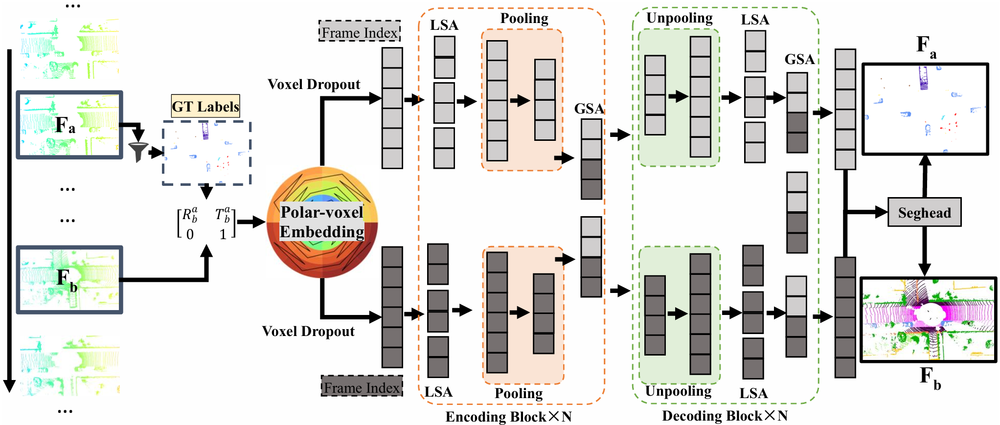
</div>
The architecture diagram above illustrates the Cylinder-Former framework.

## Overview

- [Quantitative Results](#Quantitative-Results)
- [Qualitative Results](#Qualitative-Results)
- [Installation](#installation)
- [Data Preparation](#data-preparation)
- [Quick Start](#quick-start)
- [CylinderFormer Training Process](#cylinderformer-training-process)
- [Model Release](#model-release)
- [Acknowledgement](#Acknowledgement)


## Quantitative Results

We evaluate our Cylinder-Former on the SemanticKITTI validation set (Sequence 08) and compare it against state-of-the-art methods. Table below presents the per-class IoU and mean IoU (mIoU) for 19 semantic categories. There are three versions of Cylinder-Former (CF). The first is a standard multi-frame fusion version without knowledge distillation. CF (GT) serves as the teacher model, which incorporates historical frame fusion based on ground truth (GT) labels for FSA. And It is also used to estimate the theoretical upper bound of the model’s achievable segmentation mIoU (77.8%) under current multi-frame architecture. CF (KD) with an mIoU of 72.1%, on the other hand, is the student model derived from the distillation strategy based on CF (GT), and it only performs segmentation on the current frame. 

### Quantitative Results of SOTA on SemanticKITTI Val Set

| Modality | Methods | mIoU | car | pole | road | fence | truck | trunk | person | terrain | bicycle | parking | building | bicyclist | sidewalk | vegetation | traffic-sign | motorcycle | motorcyclist | other-vehicle | other-ground |
|----------|------|------|-----|------|------|-------|-------|-------|--------|---------|---------|---------|----------|-----------|----------|------------|--------------|------------|--------------|---------------|--------------|
| **Point** | RandLA-Net | 53.9 | 94.2 | 26.0 | 25.8 | 40.1 | 38.9 | 49.2 | 48.2 | 7.2 | 90.7 | 60.3 | 73.7 | 20.4 | 86.9 | 56.3 | 81.4 | 61.3 | 66.8 | 49.2 | 47.7 |
| **Point**| WaffleIron | 68.0 | 96.1 | 58.1 | 79.7 | 77.4 | 59.0 | 81.1 | 92.2 | 1.3 | 95.5 | 50.2 | 83.6 | 6.0 | 92.1 | 67.5 | 87.8 | 73.8 | 73.0 | 65.7 | 52.2 |
| **Point**| PTv2 | 69.7 | 95.7 | 57.7 | 83.0 | 92.6 | 48.5 | 81.0 | 90.0 | 39.1 | 95.4 | 42.8 | 83.4 | 0.2 | 92.0 | 65.6 | 88.3 | 73.1 | 74.3 | 67.2 | 53.6 |
| **Projection** | RangeNet53++ | 52.2 | 91.4 | 25.7 | 34.4 | 25.7 | 23.0 | 38.3 | 38.8 | 4.8 | 91.8 | 65.0 | 75.2 | 27.8 | 87.4 | 58.6 | 80.5 | 55.1 | 64.6 | 47.9 | 55.9 |
| **Projection**| SqueezeSeg | 55.9 | 92.5 | 38.7 | 36.5 | 29.6 | 33.0 | 45.6 | 46.2 | 20.1 | 91.7 | 63.4 | 74.8 | 26.4 | 89.0 | 59.4 | 82.0 | 58.7 | 65.4 | 49.6 | 58.9 |
| **Projection**| FIDNet | 62.7 | 94.2 | 44.4 | 59.6 | 81.9 | 46.2 | 73.1 | 85.3 | 0.0 | 95.2 | 38.8 | 82.6 | 1.7 | 88.0 | 52.5 | 84.6 | 67.3 | 68.4 | 68.9 | 57.6 |
| **Projection**| SalsaNext | 62.9 | 95.1 | 54.2 | 50.8 | 78.5 | 44.5 | 67.9 | 87.1 | 0.0 | 95.2 | 51.7 | 82.5 | 0.7 | 86.3 | 57.0 | 85.0 | 66.0 | 70.0 | 68.5 | 54.3 |
| **Projection**| FRNet | 63.2 | 96.5 | 47.8 | 61.2 | 75.7 | 65.2 | 64.3 | 77.9 | 3.1 | 95.7 | 56.4 | 83.4 | 4.9 | 89.2 | 55.8 | 84.9 | 59.4 | 72.4 | 62.3 | 46.1 |
| **Projection**| CENET | 65.5 | 95.7 | 52.9 | 74.7 | 72.1 | 66.2 | 79.0 | 86.4 | 0.0 | 95.7 | 43.8 | 83.1 | 0.6 | 88.3 | 57.1 | 85.0 | 67.0 | 68.9 | 69.7 | 58.3 |
| **Voxel** | JS3C-Net | 66.0 | 95.8 | 59.3 | 52.9 | 54.3 | 46.0 | 69.5 | 65.4 | 39.9 | 88.9 | 61.9 | 72.1 | 31.9 | 92.5 | 70.8 | 84.5 | 69.8 | 67.9 | 60.7 | 68.7 |
| **Voxel**| Cylinder3D | 67.8 | 97.1 | 67.6 | 64.0 | 59.0 | 58.6 | 73.9 | 67.9 | 36.0 | 91.4 | 65.1 | 75.5 | 32.3 | 91.0 | 66.5 | 85.4 | 71.8 | 68.5 | 62.6 | 65.6 |
| **Voxel**| LPSF-LiDARNet | 68.4 | 97.2 | 56.7 | 73.1 | 68.6 | 66.1 | 79.7 | 90.4 | 38.3 | 93.9 | 48.6 | 81.3 | 3.1 | 91.6 | 62.0 | 87.5 | 69.1 | 73.6 | 64.8 | 53.3 |
| **Voxel**| MinkUNet | 70.4 | 98.0 | 61.0 | 83.0 | 93.1 | 82.7 | 80.3 | 90.4 | 11.0 | 94.2 | 56.5 | 82.2 | 0.1 | 92.2 | 68.7 | 88.5 | 69.0 | 74.7 | 66.0 | 47.0 |
| **Fusion** | LatticeNet | 52.9 | 92.9 | 16.6 | 22.2 | 26.6 | 21.4 | 35.6 | 43.0 | 46.0 | 90.0 | 59.4 | 74.1 | 22.0 | 88.2 | 58.8 | 81.7 | 63.6 | 63.1 | 51.9 | 48.4 |
| **Fusion**| RPVNet | 68.7 | 98.0 | 43.7 | 81.9 | 88.6 | 79.9 | 76.8 | 93.2 | 0.1 | 95.4 | 55.8 | 83.6 | 0.2 | 91.7 | 65.1 | 87.9 | 69.8 | 73.8 | 66.8 | 52.4 |
| **Fusion**| SPVCNN | 70.1 | 97.5 | 60.4 | 85.1 | 86.3 | 79.1 | 81.9 | 92.9 | 7.1 | 94.1 | 57.7 | 82.2 | 0.2 | 91.7 | 66.4 | 88.4 | 68.4 | 74.4 | 65.6 | 52.2 |
| **Serialization** | PTv3  | 68.2 | 96.9 | 53.7 | 77.2 | 86.8 | 68.8 | 76.9 | 90.5 | 0.0 | 95.2 | 55.9 | 84.5 | 1.0 | 90.8 | 63.0 | 88.5 | 71.6 | 75.0 | 66.9 | 53.1 |
| **Serialization**| **Cylinder-Former** | **70.9** | **98.0** | **60.2** | **79.8** | **94.4** | **83.4** | **81.0** | **92.6** | **0.0** | **95.9** | **62.3** | **84.6** | **0.2** | **91.3** | **64.8** | **88.5** | **73.1** | **74.9** | **66.5** | **54.7** |
| **Serialization**| **Cylinder-Former (KD)** | **72.1** | **98.1** | **57.6** | **75.5** | **95.1** | **83.8** | **77.1** | **91.2** | **0.0** | **95.9** | **68.3** | **87.7** | **0.1** | **94.1** | **79.6** | **91.8** | **76.5** | **82.1** | **66.4** | **49.9** |
| **Serialization**| **Cylinder-Former (GT)** | **77.8** | **98.4** | **69.4** | **77.4** | **97.0** | **92.9** | **86.6** | **92.4** | **0.0** | **96.4** | **74.4** | **91.2** | **11.5** | **95.1** | **89.1** | **97.0** | **88.5** | **91.1** | **73.3** | **58.0** |


## Qualitative Results
### Single-Frame Segmentation Comparison
The following table presents a gingle-frame visual comparison of segmentation results on validation sequences. Four models are evaluated: Ground Truth (GT), PTv3 without PPT (baseline, mIoU=68.2%), CylinderFormer (mIoU=70.9%), and CylinderFormer with Knowledge Distillation (CylinderFormer(KD), mIoU=72.1%). Results are shown for frames 000364 and 002562.

| Frame  |            GT             |      PTv3 Without PPT (baseline) (mIoU=68.2%)      |           CylinderFormer (mIoU=70.9%)            |          CylinderFormer(KD) (mIoU=72.1%)           |
|:-------|:--------------------------------------------------:|:--------------------------------------------------:|:------------------------------------------------:|:--------------------------------------------------:|
| 000364 |  | 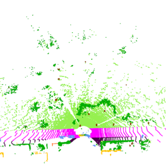  | 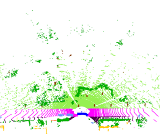  | 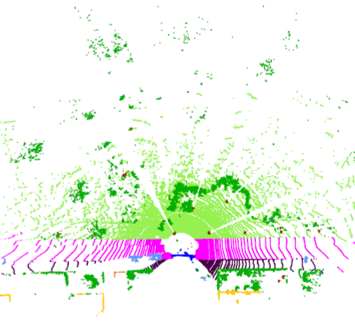  |
| 002562 | 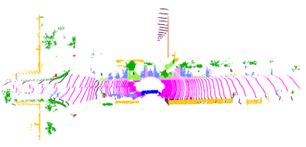 | 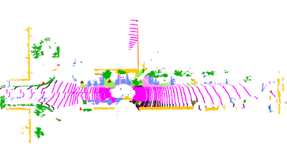 | 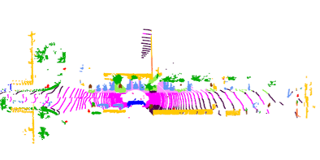 |  |

### Sequential Segmentation Label Visualization
The videos below demonstrate continuous segmentation label predictions over time:

<div align='middle'>
<video controls width="600" poster="images/2562/ptv3_pred.png">
  <source src="images/ptv3_pred.mp4" type="video/mp4">
</video>

PTv3 Without PPT (baseline)

<video controls width="600" poster="images/2562/cf_pred.png">
  <source src="images/cf_pred.mp4" type="video/mp4">
</video>

CylinderFormer

<video controls width="600" poster="images/2562/cfkd_pred.png">
  <source src="images/cfkd_pred.mp4" type="video/mp4">
</video>

CylinderFormer(KD)
</div>

### Single-Frame Correctness Comparison
This table provides a binary visualization where gray indicates correctly segmented points and red indicates misclassified points, offering insight into error distributions across models.

| Frame  |            GT             |      PTv3 Without PPT (baseline) (mIoU=68.2%)      |           CylinderFormer (mIoU=70.9%)            |          CylinderFormer(KD) (mIoU=72.1%)           |
|:-------|:--------------------------------------------------:|:---------------------------------------------:|:-------------------------------------------:|:---------------------------------------------:|
| 000364 |  | 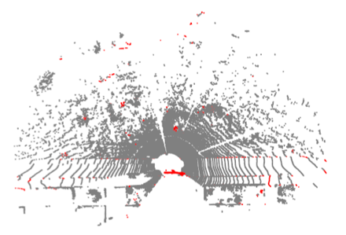  | 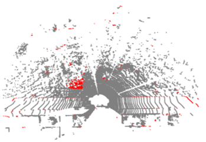  | 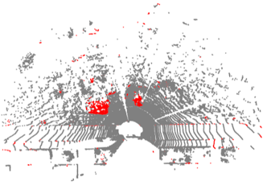  |
| 002562 |  | 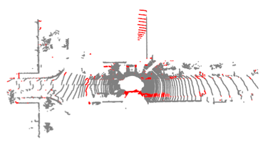 | 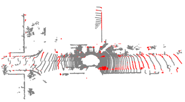 | 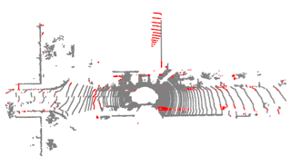 |

### Sequential Correctness Visualization
The following videos display temporal consistency of correct (gray) and incorrect (red) predictions:

<div align='middle'>
<video controls width="600" poster="images/2562/ptv3.png">
  <source src="images/ptv3.mp4" type="video/mp4">
</video>

PTv3 Without PPT (baseline)

<video controls width="600" poster="images/2562/cf.png">
  <source src="images/cf_pred.mp4" type="video/mp4">
</video>

CylinderFormer

<video controls width="600" poster="images/2562/cfkd.png">
  <source src="images/cfkd.mp4" type="video/mp4">
</video>

CylinderFormer(KD)
</div>

## Installation

### Requirements
- Ubuntu: 20.04 and above.
- CUDA: 11.8 and above.
- PyTorch: 2.1.0 and above.

### Conda Environment

Manually create a conda environment:
  ```bash
  conda create -n pointcept python=3.8 -y
  pip install torch==2.1.0+cu118 torchvision torchaudio --index-url https://download.pytorch.org/whl/cu118
  pip install ninja
  pip install h5py pyyaml
  pip install sharedarray tensorboard tensorboardx yapf addict einops scipy plyfile termcolor timm -i https://pypi.tuna.tsinghua.edu.cn/simple
  pip install torch-cluster -f https://data.pyg.org/whl/torch-2.1.0+cu118.html
  pip install torch-scatter -f https://data.pyg.org/whl/torch-2.1.0+cu118.html
  pip install torch-sparse -f https://data.pyg.org/whl/torch-2.1.0+cu118.html
  pip install torch-geometric

  pip install flash-attn --no-build-isolation
  pip install spconv-cu118 -i https://pypi.tuna.tsinghua.edu.cn/simple
  pip install numba -i https://pypi.tuna.tsinghua.edu.cn/simple

  # PTv1 & PTv2 or precise eval
  cd libs/pointops
  # usual
  python setup.py install
  ```

## Data Preparation

### SemanticKITTI
- Download [SemanticKITTI](http://www.semantic-kitti.org/dataset.html#download) dataset.
- Link dataset to codebase.
  ```bash
  # SEMANTIC_KITTI_DIR: the directory of SemanticKITTI dataset.
  # |- SEMANTIC_KITTI_DIR
  #   |- dataset
  #     |- sequences
  #       |- 00
  #       |- 01
  #       |- ...
  
  mkdir -p data
  ln -s ${SEMANTIC_KITTI_DIR} ${CODEBASE_DIR}/data/semantic_kitti
  ```


## Quick Start

### Training
**Train from scratch.** The training processing is based on configs in `configs` folder. 
The training script will generate an experiment folder in `exp` folder and backup essential code in the experiment folder.
Training config, log, tensorboard, and checkpoints will also be saved into the experiment folder during the training process.
```bash
export CUDA_VISIBLE_DEVICES=${CUDA_VISIBLE_DEVICES}
# Script (Recommended)
sh scripts/train.sh -p ${INTERPRETER_PATH} -g ${NUM_GPU} -d ${DATASET_NAME} -c ${CONFIG_NAME} -n ${EXP_NAME}
# Direct
export PYTHONPATH=./
python tools/train.py --config-file ${CONFIG_PATH} --num-gpus ${NUM_GPU} --options save_path=${SAVE_PATH}
```

For example:
```bash
# By script (Recommended)
# -p is default set as python and can be ignored
sh scripts/train.sh -p python -d semantic_kitti -c cylinderformer -n cylinderformer
# Direct
export PYTHONPATH=./
python tools/train.py --config-file configs/semantic_kitti/cylinderformer.py --options save_path=exp/semantic_kitti/cylinderformer
```
**Resume training from checkpoint.** If the training process is interrupted by accident, the following script can resume training from a given checkpoint.
```bash
export CUDA_VISIBLE_DEVICES=${CUDA_VISIBLE_DEVICES}
# Script (Recommended)
# simply add "-r true"
sh scripts/train.sh -p ${INTERPRETER_PATH} -g ${NUM_GPU} -d ${DATASET_NAME} -c ${CONFIG_NAME} -n ${EXP_NAME} -r true
# Direct
export PYTHONPATH=./
python tools/train.py --config-file ${CONFIG_PATH} --num-gpus ${NUM_GPU} --options save_path=${SAVE_PATH} resume=True weight=${CHECKPOINT_PATH}
```

### Testing
During training, model evaluation is performed on point clouds after grid sampling (voxelization), providing an initial assessment of model performance. However, to obtain precise evaluation results, testing is **essential**. The testing process involves subsampling a dense point cloud into a sequence of voxelized point clouds, ensuring comprehensive coverage of all points. These sub-results are then predicted and collected to form a complete prediction of the entire point cloud. This approach yields  higher evaluation results compared to simply mapping/interpolating the prediction. In addition, our testing code supports TTA (test time augmentation) testing, which further enhances the stability of evaluation performance.

```bash
# By script (Based on experiment folder created by training script)
sh scripts/test.sh -p ${INTERPRETER_PATH} -g ${NUM_GPU} -d ${DATASET_NAME} -n ${EXP_NAME} -w ${CHECKPOINT_NAME}
# Direct
export PYTHONPATH=./
python tools/test.py --config-file ${CONFIG_PATH} --num-gpus ${NUM_GPU} --options save_path=${SAVE_PATH} weight=${CHECKPOINT_PATH}
```
For example:
```bash
# By script (Based on experiment folder created by training script)
# -p is default set as python and can be ignored
# -w is default set as model_best and can be ignored
sh scripts/test.sh -p python -d semantic_kitti -n cylinderformer -w model_best
# Direct
export PYTHONPATH=./
python tools/test.py --config-file configs/semantic_kitti/cylinderformer.py --options save_path=exp/semantic_kitti/cylinderformer weight=exp/semantic_kitti/cylinderformer/model/model_best.pth
```

The TTA can be disabled by replace `data.test.test_cfg.aug_transform = [...]` with:

```python
data = dict(
    train = dict(...),
    val = dict(...),
    test = dict(
        ...,
        test_cfg = dict(
            ...,
            aug_transform = [
                [dict(type="RandomRotateTargetAngle", angle=[0], axis="z", center=[0, 0, 0], p=1)]
            ]
        )
    )
)
```

## CylinderFormer Training Process

The Cylinder-Former model is trained through a three-stage pipeline to progressively enhance performance while managing computational complexity:

1. **Multi-Frame Training**: First, a multi-frame fusion model is trained **without FSA (Flexible Step Aggregation)**. This configuration achieves 70.5% mIoU and serves as the initial checkpoint to generate segmentation predictions for subsequent training phases.

2. **FSA-Enhanced Teacher Training**: Next, a multi-frame model **with FSA** is trained using ground truth (GT) point clouds. During training, FSA selectively fuses points from weak classes (IoU < 70% or point ratio < 0.5%) from historical frames. This model reaches 70.9% mIoU when evaluated using the previous stage's predictions for FSA inference. If GT labels are used for FSA during evaluation, it becomes the **teacher model** achieving 77.8% mIoU (the theoretical upper bound).

3. **Knowledge Distillation for Student Model**: Finally, the teacher model distills knowledge to train a **single-frame student model**. The student receives only the current frame as input (no direct access to supplementary frame GT labels), but benefits from FSA supervision using GT labels during training. This yields the efficient Cylinder-Former (KD) model with 72.1% mIoU.

## Model Release

**The trained models will be released after the paper is published.**

## Acknowledgement

This work is inspired by and built upon several open-source frameworks: [Pointcept](https://github.com/Pointcept/Pointcept), [MinkowskiEngine](https://github.com/NVIDIA/MinkowskiEngine), [pointnet2](https://github.com/charlesq34/pointnet2), [mmcv](https://github.com/open-mmlab/mmcv/tree/master/mmcv), and [Detectron2](https://github.com/facebookresearch/detectron2).
